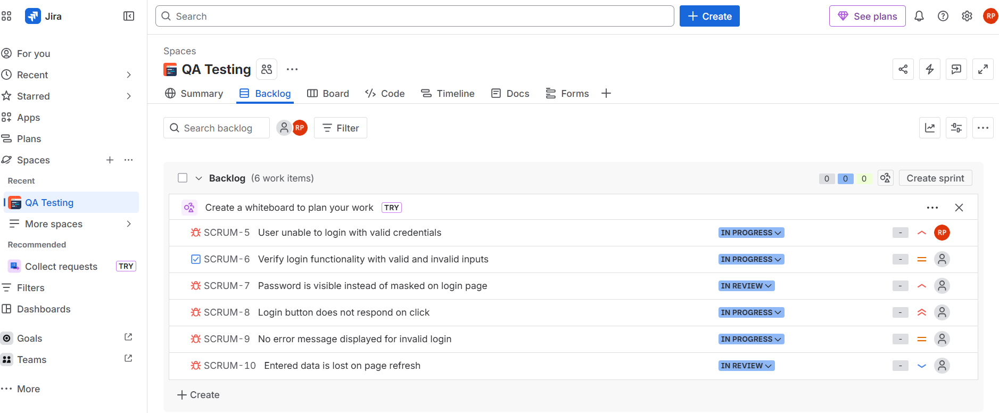
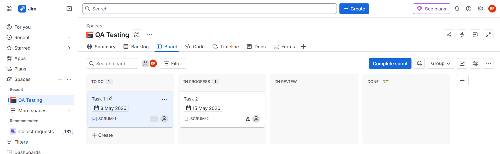
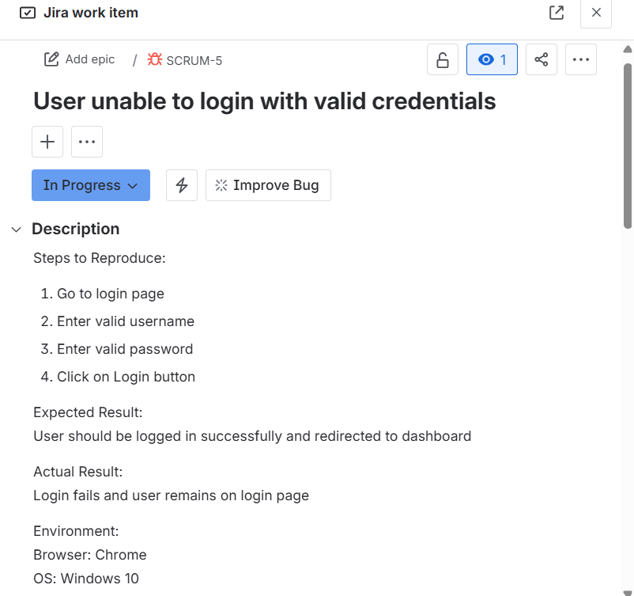

# Manual QA Testing – Login Module

## 📌 Project Overview
This project demonstrates manual testing of a web-based login functionality.  
Testing was performed to validate user authentication using different input scenarios.

**Tools Used:**
- Jira (Bug tracking)
- Agile (Scrum methodology)

---

## 📋 Test Scenarios
1. Login with valid credentials  
2. Login with invalid password  
3. Login with empty fields  
4. Login with invalid email format  
5. Password masking validation  

---

## 🐞 Bug Reports

### Bug 1: Login button not working
- **Priority:** Critical  
- **Steps:**
  1. Enter valid username and password  
  2. Click Login  
- **Expected:** User logs in  
- **Actual:** Nothing happens  

---

### Bug 2: Password visible
- **Priority:** High  
- **Steps:**
  1. Enter password  
- **Expected:** Password masked  
- **Actual:** Password visible  

---

### Bug 3: No error message on invalid login
- **Priority:** Medium  
- **Steps:**
  1. Enter wrong credentials  
- **Expected:** Error message shown  
- **Actual:** No message displayed  

---

### Bug 4: Login allowed with empty fields
- **Priority:** High  
- **Steps:**
  1. Leave fields empty  
  2. Click Login  
- **Expected:** Validation message  
- **Actual:** Login proceeds / no validation  

---

## 🔄 Workflow
Bug lifecycle followed:
- To Do → In Progress → Done  

---

## 📸 Screenshots

### Jira Backlog

### Jira Board

### Bug Details

## 📚 Learning Outcome
- Hands-on experience with Jira  
- Bug reporting and tracking  
- Understanding of Agile workflow  
- Test case and scenario design  
